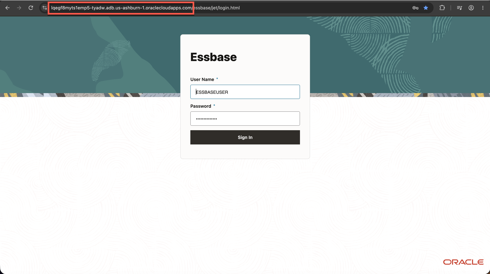
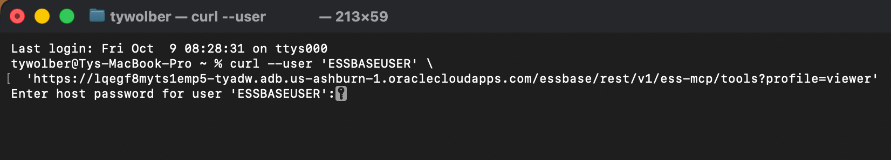
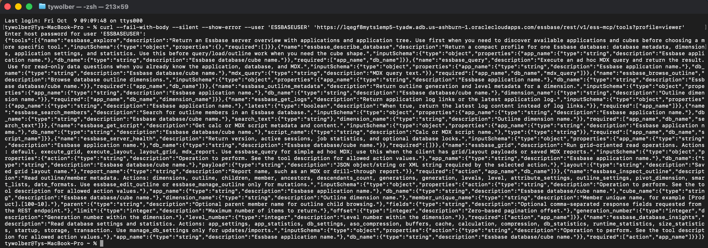
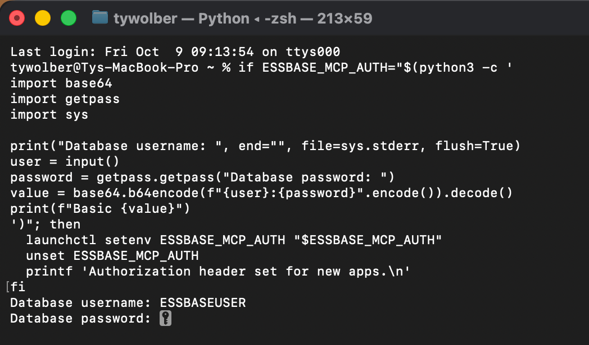
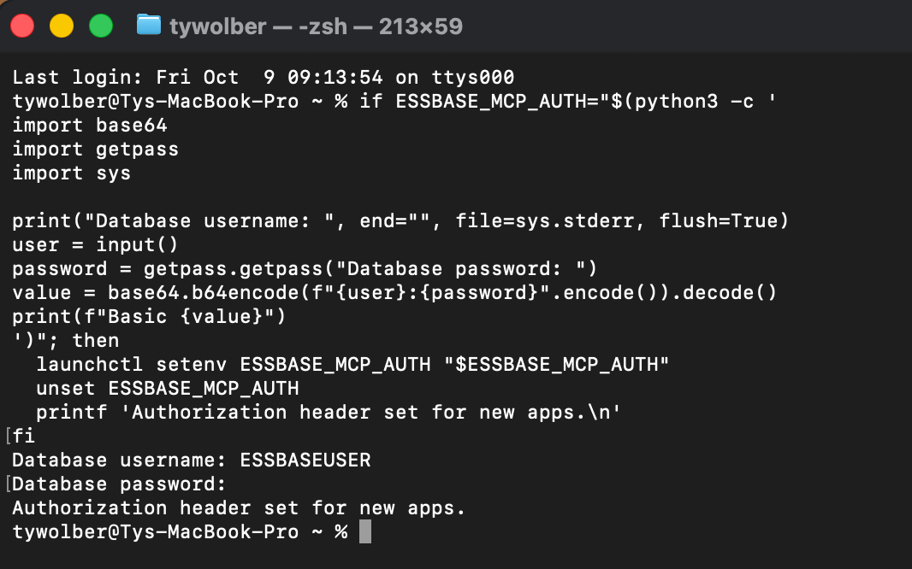
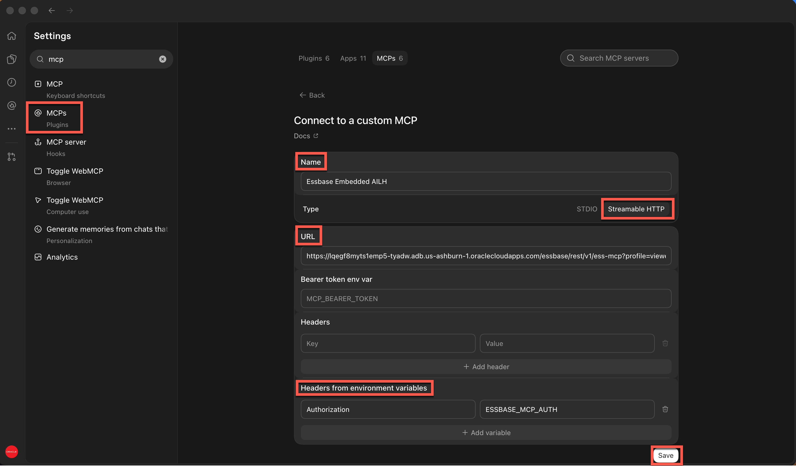

# Connect Codex to the Embedded Essbase MCP Server

## Introduction

In this optional lab, you will connect Codex to the Essbase MCP server embedded in your AI Lakehouse. You will use the read-only `viewer` profile based on your ESSBASEUSER created in Lab 1 to list the Essbase applications available to the user.

Estimated Time: 20 minutes

### About the Essbase MCP Server

Embedded Essbase provides its own MCP endpoint under `/essbase/rest/v1/ess-mcp`. This is separate from the Autonomous AI Database MCP endpoint under `/adb/mcp/v1/databases/`. For this embedded Essbase environment, use HTTP Basic authentication with the Database credentials you use to access Essbase.

### Objectives

In this lab, you will:

- Find the Essbase host and MCP URL.
- Verify the endpoint with your Database credentials.
- Configure Codex to send the authorization header.
- Use a read-only Essbase MCP tool to list applications.

### Prerequisites

This lab assumes you have:

- An AI Lakehouse with embedded Essbase available.
- The Essbase login URL and a Database username and password that can sign in to Essbase.
- Access to the PeakGear application imported earlier in the workshop.
- Codex desktop and terminal access with `python3` and `curl`.

## Task 1: Find the Essbase MCP URL

1. Open the Essbase login page used earlier in this workshop. Its URL has this form:

   ```text
   https://essbase-host/essbase/jet/login.html
   ```

2. Copy only the host name between `https://` and `/essbase`. Build the read-only MCP URL and save it for Task 4:

   ```text
   https://essbase-host/essbase/rest/v1/ess-mcp?profile=viewer
   ```


3. Build the tool-catalog URL for the verification step in Task 2:

   ```text
   https://essbase-host/essbase/rest/v1/ess-mcp/tools?profile=viewer
   ```

> **Note:** Use the host URL from the **Essbase login page**, not the `dataaccess.adb.../adb/mcp/v1/databases/...` URL for the Autonomous AI Database MCP server.

## Task 2: Verify the Essbase MCP Endpoint

1. In a terminal, run the following command. Replace the host and username with your values. Leave the username inside the quotes.

   ```bash
   curl --fail-with-body --silent --show-error \
     --user 'ESSBASEUSER' \
     'https://essbase-host/essbase/rest/v1/ess-mcp/tools?profile=viewer'
   ```

2. When `curl` prompts for a password, enter your Database password. The password will not appear as you type.


3. Confirm the response contains Essbase tool names, including `essbase_explore`. The `viewer` profile exposes read-only tools.


> **Troubleshooting:** HTTP 401 means the endpoint was reached but authentication failed. Check the Database username and password. HTTP 404 usually means the host or `/essbase/rest/v1/ess-mcp/tools` path is incorrect.

## Task 3: Make the Authorization Header Available to Codex

Codex will read the complete HTTP `Authorization` header from an environment variable named `ESSBASE_MCP_AUTH`. The following command prompts for your credentials, creates the required `Basic` value, and makes it available to newly launched macOS apps.

1. Paste and run the **entire** block in Terminal without changing the Python code:

   ```bash
   if ESSBASE_MCP_AUTH="$(python3 -c '
   import base64
   import getpass
   import sys

   print("Database username: ", end="", file=sys.stderr, flush=True)
   user = input()
   password = getpass.getpass("Database password: ")
   value = base64.b64encode(f"{user}:{password}".encode()).decode()
   print(f"Basic {value}")
   ')"; then
     launchctl setenv ESSBASE_MCP_AUTH "$ESSBASE_MCP_AUTH"
     unset ESSBASE_MCP_AUTH
     printf 'Authorization header set for new apps.\n'
   fi
   ```

2. At `Database username:`, type your Essbase username and press **Return**. At `Database password:`, type your Essbase password and press **Return**. The password stays hidden.


3. Confirm Terminal prints `Authorization header set for new apps.` Do not print the environment variable: its value contains your encoded credentials.


> **Note:** Base64 encoding is not encryption. The macOS launch environment retains this value until you remove it or end the login session. Perform Task 5 when finished.

## Task 4: Add the Essbase MCP Server to Codex

1. Open **Codex → Settings → MCP servers → Add server**.

2. Enter these values:

   | Field | Value |
   |---|---|
   | Name | `Essbase Embedded AILH` |
   | Type | `Streamable HTTP` |
   | URL | `https://<essbase-host>/essbase/rest/v1/ess-mcp?profile=viewer` |
   | Bearer token env var | Leave blank |
   | Headers | Leave blank |
   | Headers from environment variables — Key | `Authorization` |
   | Headers from environment variables — Value | `ESSBASE_MCP_AUTH` |

3. Replace `<essbase-host>` in the URL with the host you found in Task 1, then **Save**.


4. Fully quit and reopen Codex so its new process receives `ESSBASE_MCP_AUTH`.

5. In a new Codex chat, enter:

   ```text
   Using the Essbase Embedded AILH MCP server, run essbase_explore and list the Essbase applications available to me.
   ```

6. Confirm the result lists the applications your Database user can access. PeakGear should appear if that user has permission to it in Essbase.

> **Troubleshooting:** If Codex reports an authentication error but Task 2 succeeded, check that `Authorization` is entered under **Headers from environment variables**, its value is exactly `ESSBASE_MCP_AUTH`, and Codex was fully quit and reopened after Task 3.

## Task 5: Remove the Credential After the Lab

1. When you finish using the connection, remove the value from the macOS launch environment:

   ```bash
   launchctl unsetenv ESSBASE_MCP_AUTH
   ```

2. Fully quit and reopen Codex. To use the connection again in a later session, repeat Task 3 with your current Database credentials.

## Learn More

- [Connect an AI Client to the Essbase MCP Server](https://docs.oracle.com/en/database/other-databases/essbase/26/esmcp/connect-ai-client.html)
- [Essbase MCP Access Profiles](https://docs.oracle.com/en/database/other-databases/essbase/26/esmcp/mcp-access-profiles.html)
- [Configure MCP Servers in Codex](https://developers.openai.com/codex/mcp)