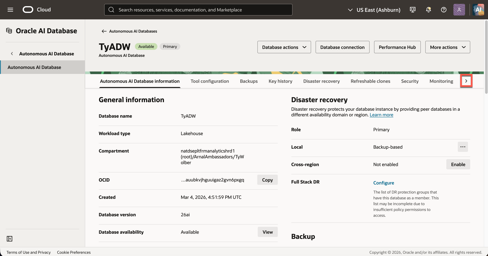
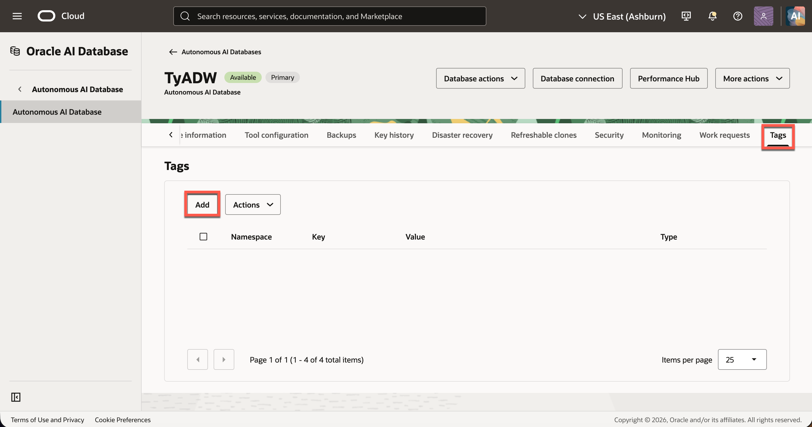
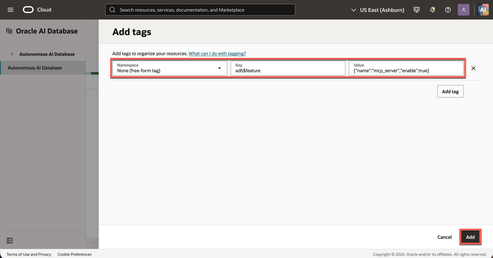
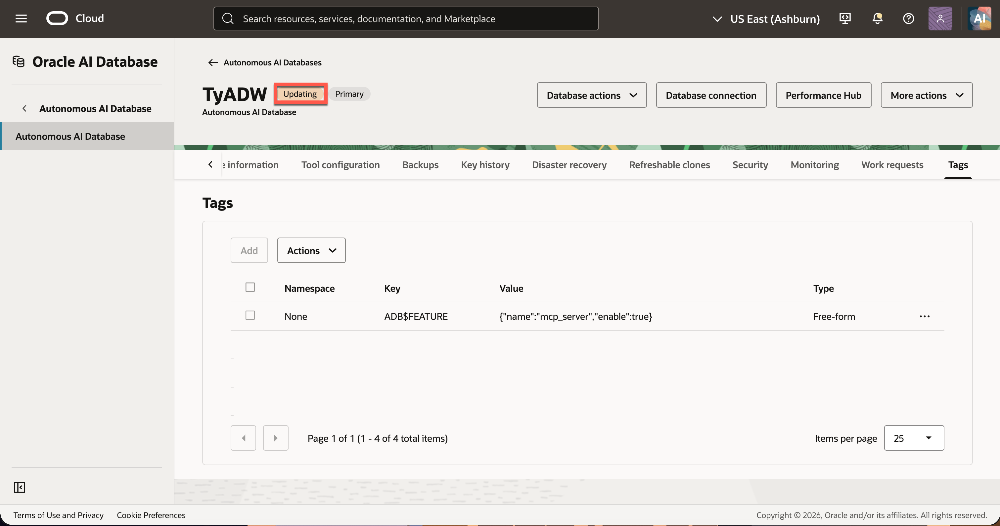

# Connect Codex to the AI Lakehouse MCP Server

## Introduction

In this optional lab, you will connect ChatGPT through Codex to the AI Lakehouse MCP server with read-only access. You will discover the available tools and ask the client to list the Essbase applications available to your user, including the PeakGear application imported in Lab 3.

Estimated Time: 20 minutes

### About AI Lakehouse MCP

The AI Lakehouse MCP server exposes your Essbase data to compatible AI clients. The `viewer` access profile exposes read-only tools. Your Essbase permissions still determine which applications you can see.

### Objectives

In this lab, you will:

- Configure the AI Lakehouse MCP endpoint for your environment.
- Connect an approved AI client with the `viewer` profile.
- List the Essbase applications available to your user.

### Prerequisites

This lab assumes you have:

- Access to the PeakGear application imported in Lab 3.
- An approved MCP-compatible AI client.
- OCI admin credentials for your AI Lakehouse to configure a MCP endpoint.


## Task 1: Enable the MCP Server

1. In the OCI Console, click the hamburger menu in the top left, **Oracle AI Database** then **Autonomous AI Database**.


2. Confirm you are in the correct **Region** and **Compartment**, then select your **AI Lakehouse**.


3. On the database details page, click the right arrow then **Tags**.


4. Click **Add** on the **Tags** page.


5. Enter the following information for each section then click **Add**:

   | Namespace | Key | Value |
   |---|---|---|
   | `None (free-form tag)` | `adb$feature` | `{"name":"mcp_server","enable":true}` |



6. Wait for the Database to finish updating then move on to Task 2.


> **Note:** Oracle specifies one value for the `adb$feature` tag at a time. If your lab uses this tag for something else, have the lab administrator verify the feature configuration before changing it.

## Task 2: Add the MCP Server to Codex

1. Open a terminal where the `codex` command is available.
2. Replace `<region-identifier>` and `<database-ocid>` in the command below with your database values. Run the command:

   ```bash
   codex mcp add ailakehouse \
     --url "https://dataaccess.adb.<region-identifier>.oraclecloudapps.com/adb/mcp/v1/databases/<database-ocid>"
   ```

3. Confirm that `ailakehouse` appears in the configured server list:

   ```bash
   codex mcp list
   ```

> **Private endpoint:** If your database uses a private endpoint, use its private MCP hostname instead. Your computer must be able to reach that private network.

## Task 3: Sign In Through the OAuth Window

1. Start Codex’s interactive sign-in:

   ```bash
   codex mcp login ailakehouse
   ```

2. Complete the sign-in window that opens. If Codex displays a sign-in URL instead, open that URL in your browser.
3. Enter the **database username and password** assigned for this lab and complete the authorization.
4. Return to Codex after the sign-in succeeds.

> **Note:** Enter your credentials only in the Oracle sign-in window. Do not add your password to the command or to `config.toml`.

## Task 4: Verify the Connection

1. Start or restart Codex:

   ```bash
   codex
   ```

2. In Codex, enter `/mcp` and confirm that `ailakehouse` is connected.
3. Ask Codex:

   > List the tools available from the `ailakehouse` MCP server.

4. Confirm that Codex lists the Select AI Agent tools available to your database user.

If the connection succeeds but no tools appear, ask the lab administrator to confirm that Select AI Agent tools have been registered and are available to your database user.

## Learn More

- [Use the Autonomous AI Database MCP Server](https://docs.oracle.com/en/cloud/paas/autonomous-database/serverless/adbsb/use-mcp-server.html)
- [Configure MCP Servers in Codex](https://developers.openai.com/codex/mcp)