# Analyze and Investigate PeakGear Sales

## Introduction

In this optional lab, you will connect Oracle Smart View to the PeakGear cube, compare sales by period, product, and store, and drill through from a cube summary to the supporting Lakehouse transaction records.

Estimated Time: 25 minutes

### About Smart View and Drill-Through

Smart View lets you analyze Essbase data in Microsoft Excel. A drill-through report can show the detailed source records behind a cube value when an Essbase datasource and drillable region have been configured for the cube.

### Objectives

In this lab, you will:

- Connect Smart View to the PeakGear cube.
- Compare PeakGear sales across periods, products, and stores.
- Drill through from a sales value to the underlying Lakehouse detail.

### Prerequisites

This lab assumes you have:

- Microsoft Excel with a compatible Oracle Smart View for Office installation.
- The workshop user's Essbase credentials.
- The PeakGear cube imported with data in Lab 3.

## Task 1: Download and Install Smart View

1. Close Excel and all other Microsoft Office applications.
2. Open the [Oracle Smart View for Office download page](https://www.oracle.com/middleware/technologies/epm-smart-view-downloads.html).
3. Click **Download Now**. You may be prompted to sign in with your OCI credentials.
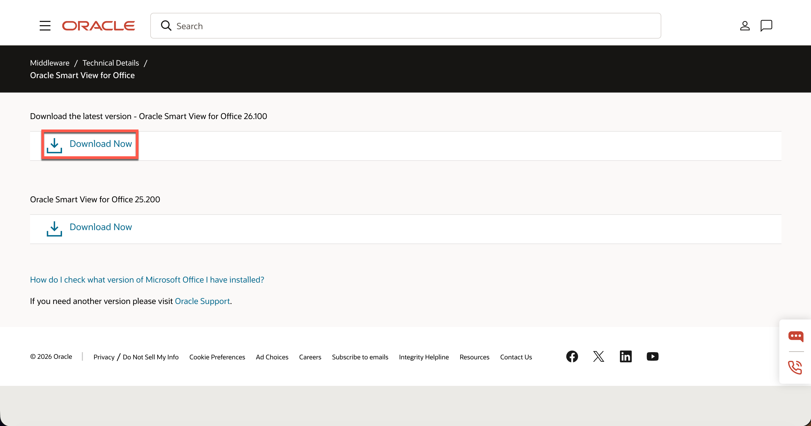

4. Check the box for the Licensing Agreement then Click the **ZIP File** for the latest version of SmartView.
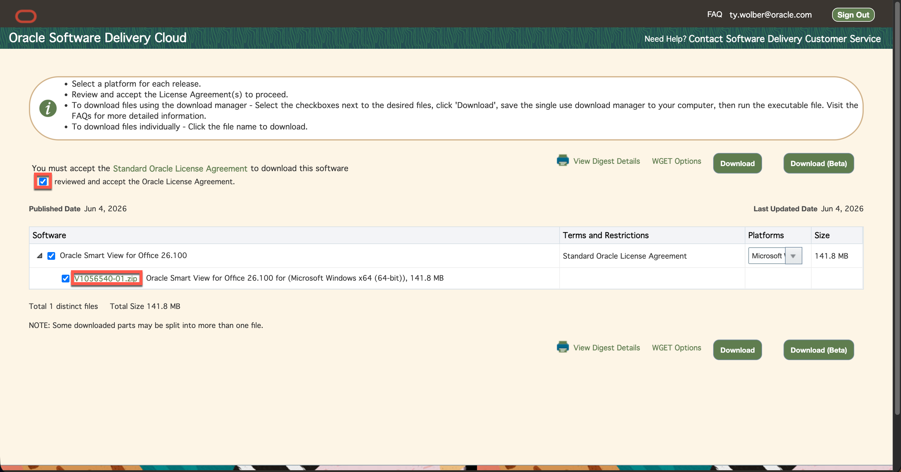

5. Extract the ZIP file.
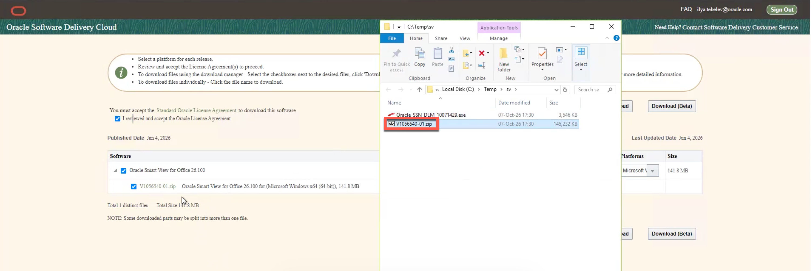

6. Open the extracted folder and run **SmartView.exe**. Follow the installation prompts.
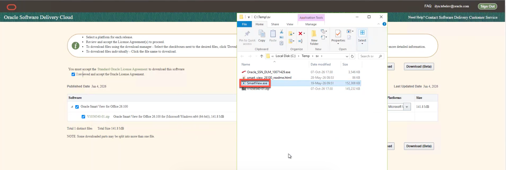

7. Reopen Excel and confirm that the **Smart View** tab appears on the ribbon. You are now ready for Task 2.

## Task 2: Connect to Essbase

1. Open a blank workbook in Excel.
2. Select **Smart View → Panel → Private Connections**.
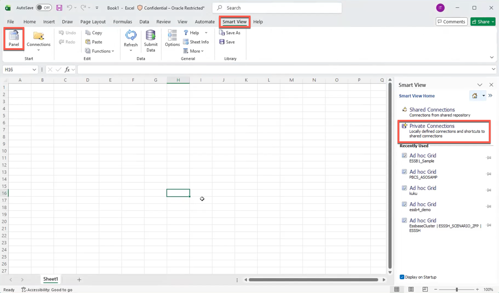

3. In the SmartView Panel select the drop down arrow then **Create new connection**.
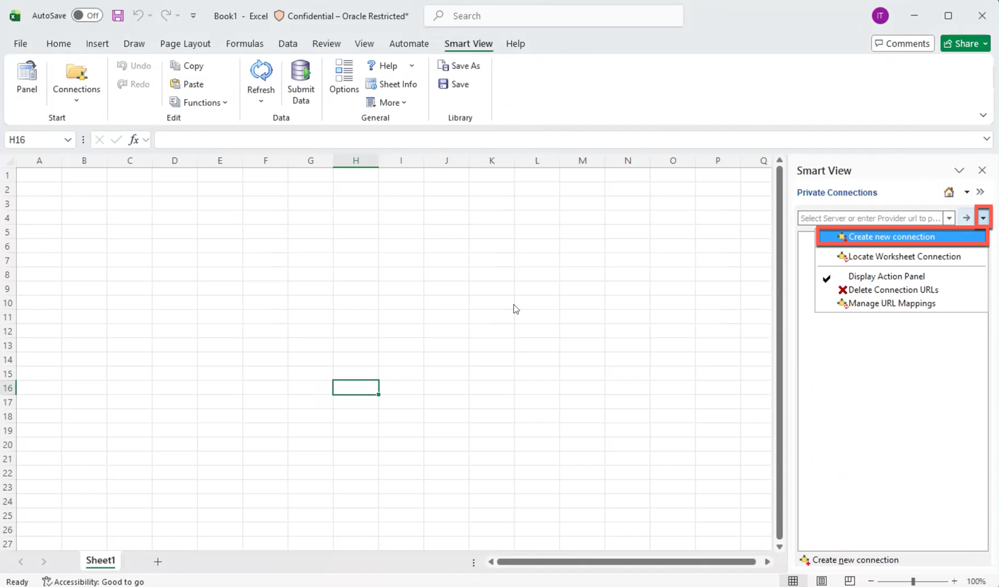

4. Select **Smart View HTTP Provider**.
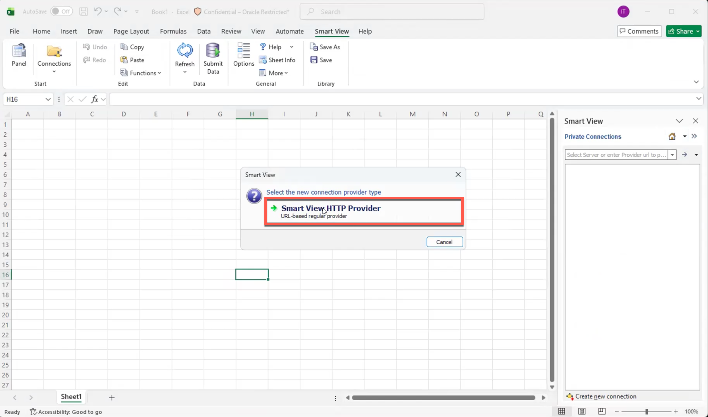

5. Enter the Smart View URL to connect. You can set this as the default connection if you would like to.

> **Note:** Copy your Essbase URL, remove every character after /essbase and add /smartview. Link should be formatted as https://<essbase-host>/essbase/smartview

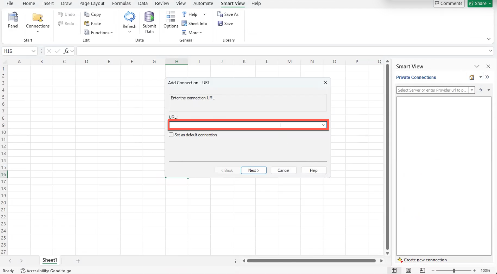

6. You will be prompted to sign in to Essbase. Use the Essbase user credentials from Lab 1.
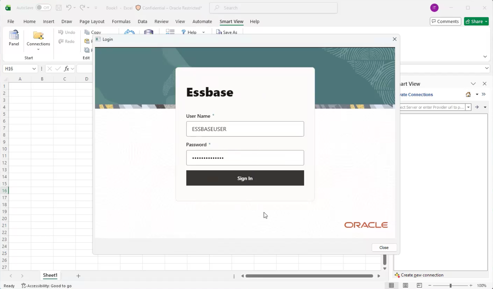

7. Select the database to view in SmartView. Drill into the Sales database by clicking the + next to **Servers → EssbaseCluster → peakgear_sales → Sales** then click **Next**.
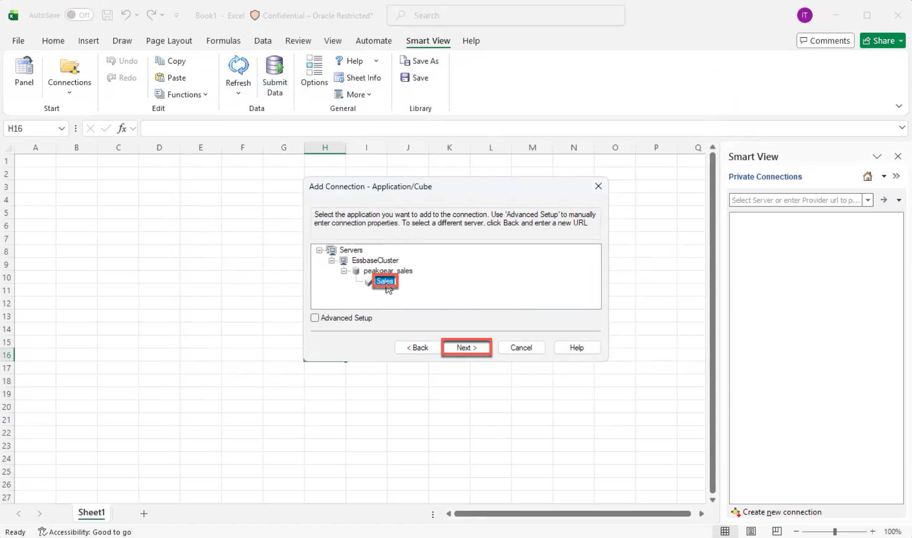

8. Provide a name for the data, such as `ADBS_PRES_SALES`, then click **Finish**.

9. Click **Connect** in the bottom right of the SmartView window. The data is now connected to SmartView
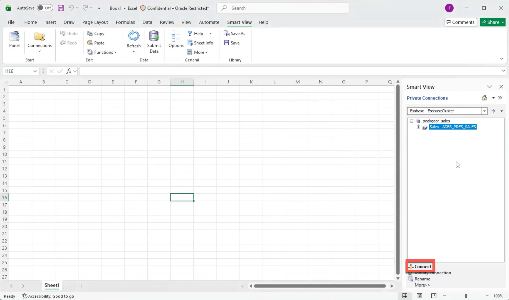

## Task 3: Ad Hoc Analysis in SmartView

1. Click **Ad Hoc Analysis** in the bottom of the SmartView window. You now are viewing the Ad Hoc Analysis function of Essbase in Excel.
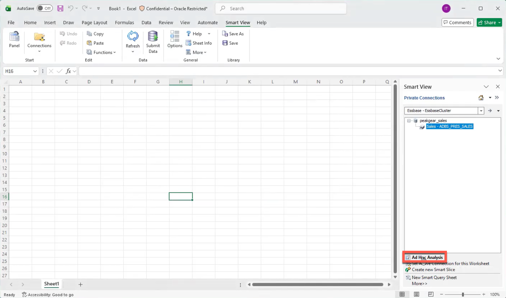

2. In **Ad Hoc Analysis**, select a member and click **Zoom In** in the upper-left toolbar. Repeat along each path:

   - `Time` → `FY2021` → `2021-Q1` → `2021-01`
   - `Product` → `ACTIVEWEAR` → `SKU-100002`
   - `Store` → `Austin` → `Store_004`
   - `Measures` → `Sales`

> **Note:** Alternatively, go directly to the same POV by renaming each dimension to the last value in its path: Time = 2021-01, Product = SKU-100002, Store = Store_004, and Measures = Sales.

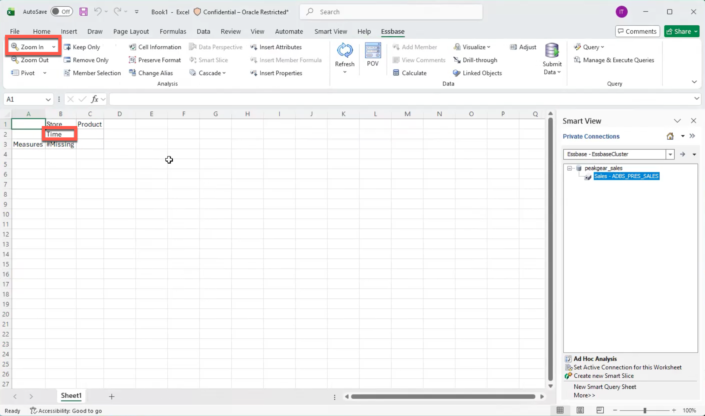

3. Select each final member and click **Keep Only**. Confirm the resulting sales value is **1,448.55**. You have now performed Ad Hoc Analysis in Excel through SmartView.
