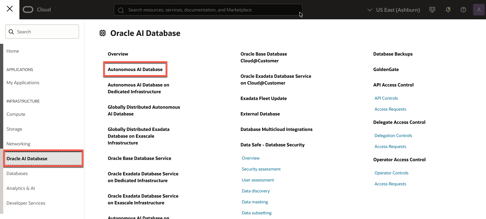
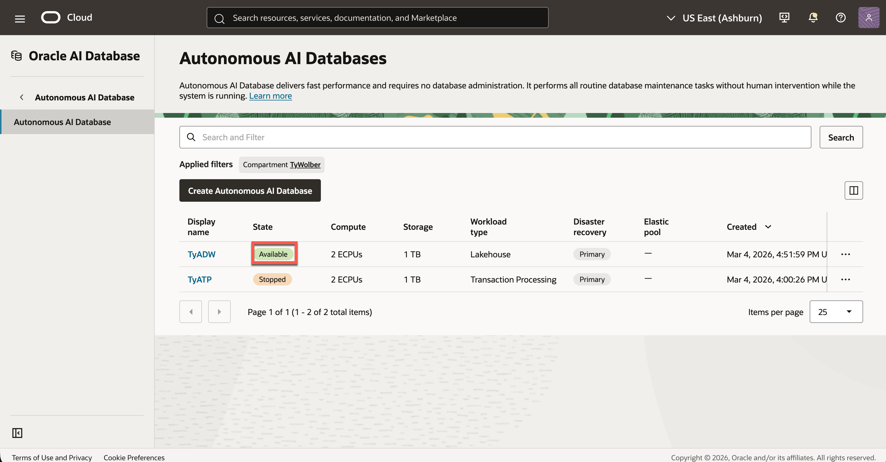
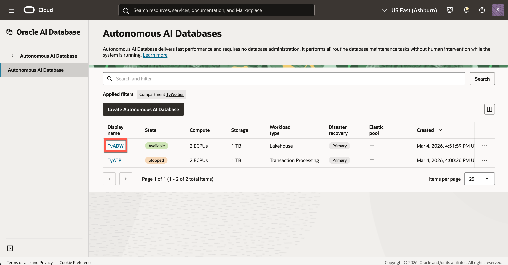
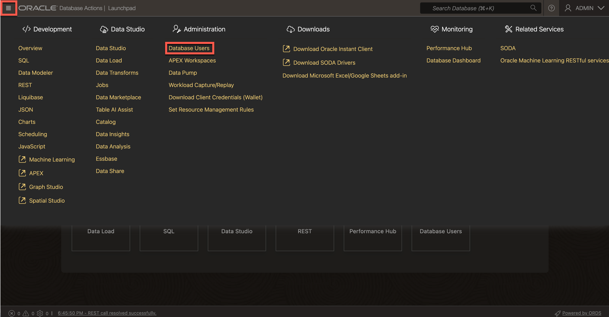
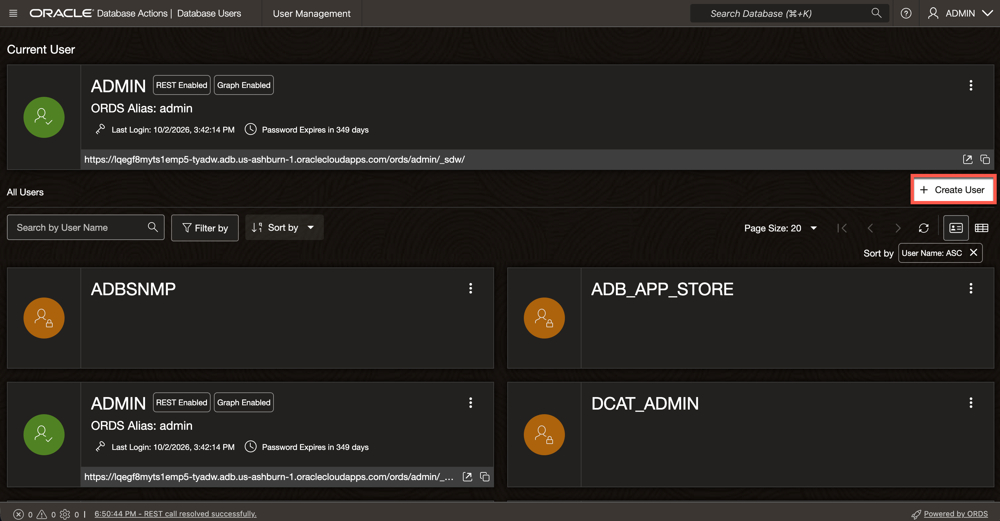
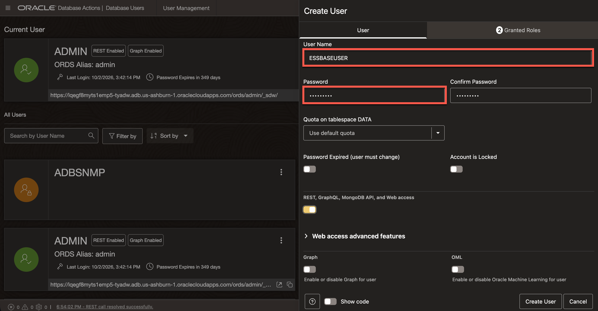
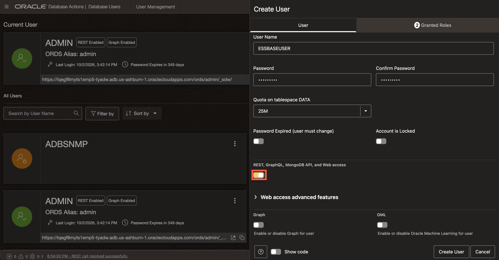
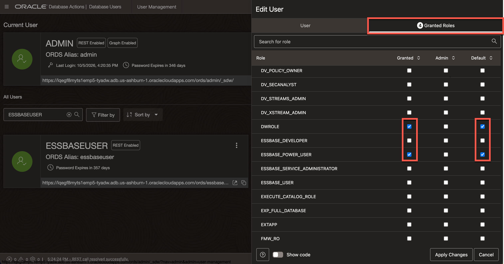
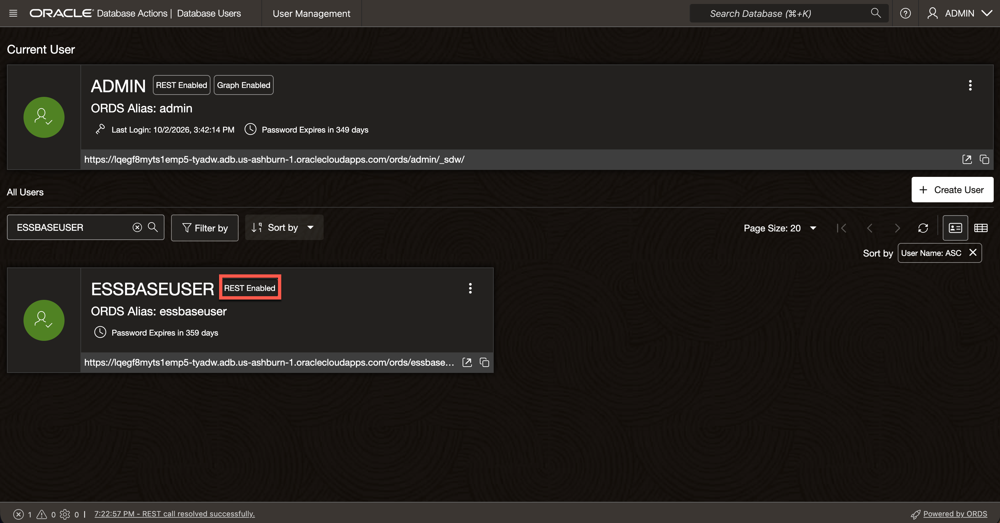
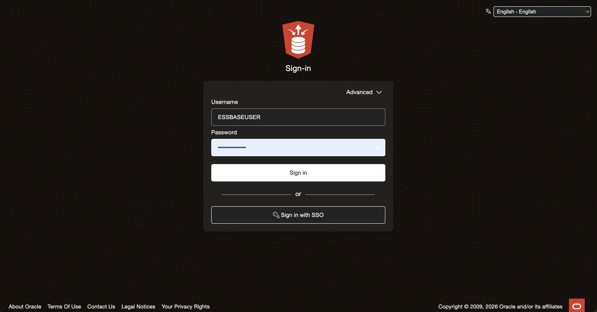

# Check the Existing Lakehouse and Prepare Access

## Introduction

In this lab, you will locate your existing Oracle Autonomous AI Lakehouseas as an ADMIN user and create a workshop Essbase user with the necessary permissions. You will then sign in as the Essbase user to confirm access to Database Actions and Data Studio.

Estimated Time: 35 minutes

### About Database Actions

Database Actions is a browser-based interface for working with your Autonomous AI Database. Access from the OCI Console and access to database tools are controlled separately. In this lab, you will use the OCI Console to find the Lakehouse, then use database credentials to sign in to Database Actions.

### Objectives

In this lab, you will:

- Locate an existing Autonomous AI Lakehouse in your tenancy.
- Open Database Actions using the database ADMIN credentials.
- Create a workshop user with Web Access and the Data Studio role.
- Verify that the workshop user can sign in.

### Prerequisites

This lab assumes you have:

- An existing Autonomous AI Lakehouse with embedded Essbase.
- An OCI ADMIN account that can view the AI Lakehouse in the Console.
- Access to Database Actions in AI Lakehouse.

## Task 1: Locate the Existing Autonomous AI Lakehouse

1. Sign in to the Oracle Cloud Infrastructure Console.

2. Open the hamburger menu in the top left corner and select **Oracle AI Database**, then **Autonomous AI Database**.

3. Select the region and compartment that contain your AI Lakehouse.

4. Find your AI Lakehouse in the database list. Confirm that it is the correct database and the lifecycle state is **Available**.

5. Click on the AI Lakehouse to access the database details page.

## Task 2: Open Database Actions

1. On the AI Lakehouse details page, open the **Database actions** menu and select **View all database actions**.

2. When prompted, sign in as the database **ADMIN** user.

3. Confirm that the Database Actions launchpad opens. Locate the **Data Studio** area and its available tools. This will be used later in the workshop.

    > **Note:** The tools shown can vary with the signed-in database user's permissions. You will verify the workshop user's view in Task 4.

## Task 3: Create and Enable the Workshop Database User

1. In Database Actions, open the hamburger menu in the top left corner. Under **Administration**, select **Database Users**.

2. Select **Create User**.

3. Enter a username for the workshop user and create a password that meets the displayed requirements. Keep the credentials saved for future use.

4. Set the  **Quota on tablespace DATA** to the amount approved for your workshop environment.

5. Enable **REST, GraphQL, MongoDB API, and Web Access** for the new user.

6. Open **Granted Roles**. Grant and set Default for both **DWROLE** and **ESSBASE_POWER_USER** so the user can access the Data Studio tools used in this workshop. Confirm that **CONNECT** and **RESOURCE** are enabled and Default as well.

7. Select **Create User** and confirm that Database Actions reports that the user was created.

8. Find the new user's card on the **Database Users** page. Confirm that the account is open and shows **REST Enabled**.

<!-- Author TODO: Add the specialist-confirmed Essbase application import permission step here. Database roles alone do not establish that permission. -->

## Task 4: Sign In as the Workshop User and Verify Access

1. Sign out of the **ADMIN** session, or open a separate private browser window.

2. Sign in with the workshop user's credentials from Task 3.

3. Keep the credentials saved and Database Actions URL available for the next lab.

You have prepared and verified the database user. In the next lab, you will use this account to launch embedded Essbase.

## Learn More

- [Connect with Built-In Oracle Database Actions](https://docs.oracle.com/en/cloud/paas/autonomous-database/serverless/adbsb/connect-database-actions.html)
- [Create and Manage Users on Autonomous AI Database](https://docs.oracle.com/en/cloud/paas/autonomous-database/serverless/adbsb/manage-users-create.html)
- [Manage User Roles and Privileges on Autonomous AI Database](https://docs.oracle.com/en/cloud/paas/autonomous-database/serverless/adbsb/manage-users-privileges.html)

## Acknowledgements

* **Author** - Ty Wolber, Cloud Engineer
* **Last Updated By/Date** - Ty Wolber, October 2026