# Import the Prepared PeakGear Application

## Introduction

In this lab, you will download the prepared PeakGear application package, extract its application workbook, and import the workbook into Essbase. You will then check the import job, cube outline, and a known sales value.

Estimated Time: 20 minutes

### About Application Workbooks

An Essbase application workbook is an Excel file that defines an application, cube, dimensions, and optional data. Importing the prepared PeakGear workbook creates the cube and loads its data without requiring you to build the outline manually.

### Objectives

In this lab, you will:

- Download and extract the PeakGear application package.
- Import the application workbook and load its data.
- Verify the import job, cube outline, and a known sales value.

### Prerequisites

This lab assumes you have:

- Access to embedded Essbase with permission to import a new application.
- The approved PeakGear application uploaded to AI Lakehouse.
- Essbase Power User permissions for cube building.

## Task 1: Import the Application and Load Data

1. Download and extract the [PeakGear Sporting Goods Data](files/peakgear-sales.zip) on your computer. This will be uploaded to Essbase to build the Sales Cube.

2. On the Essbase home page select **Import**.
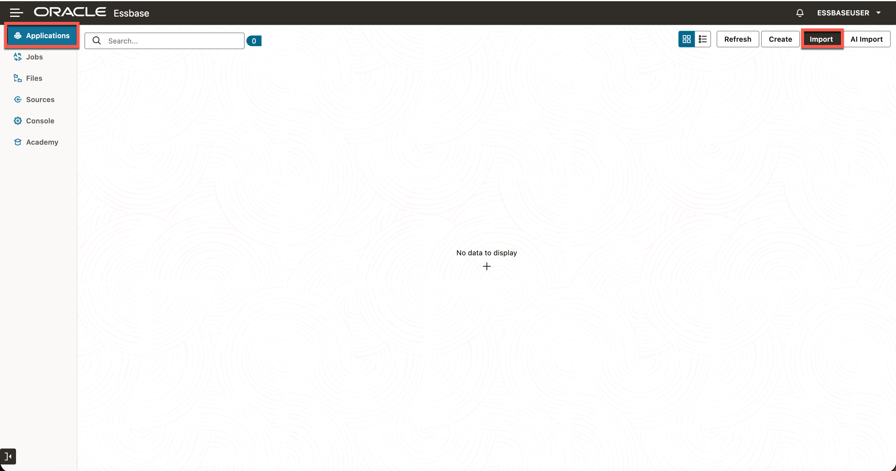

3. Select **File Browser**.
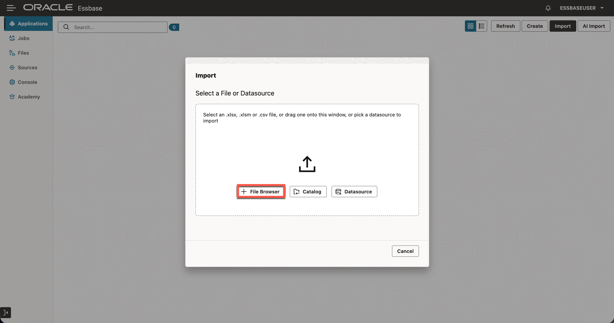

4. Select `peakgear_sales.xlsx` from the extracted package. Do not select the CSV files.
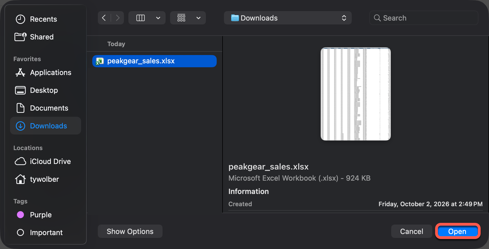
    > **Note:** Confirm the file name does not contain a space such as `peakgear_sales 2.xlsx`

5. Confirm that the application name is `peakgear_sales` and the cube name is `Sales`, then select **OK**.
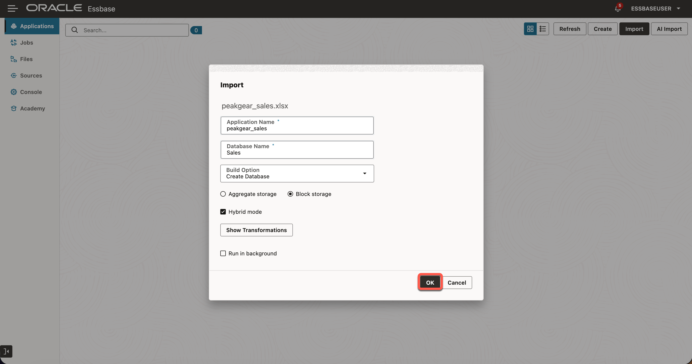

6. Confirm that one new application, `peakgear_sales`, appears on the Applications page.
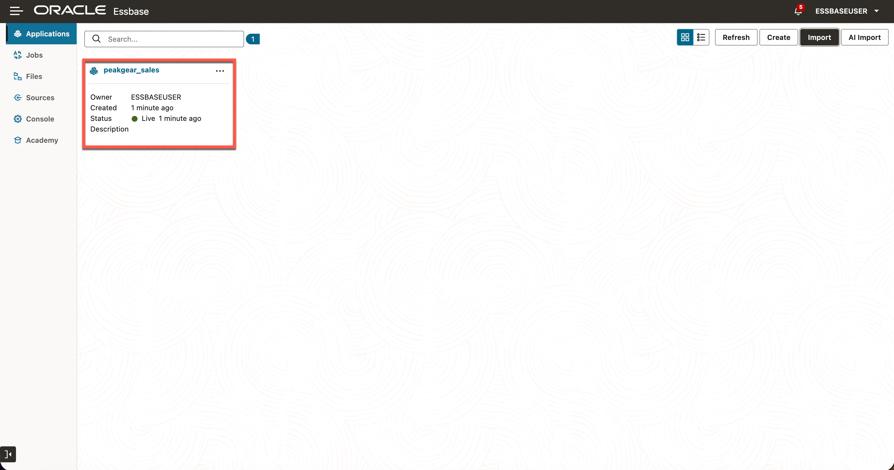

## Task 2: Review the Import Job

1. Open **Jobs** in Essbase and find the most recent import job for the PeakGear application.
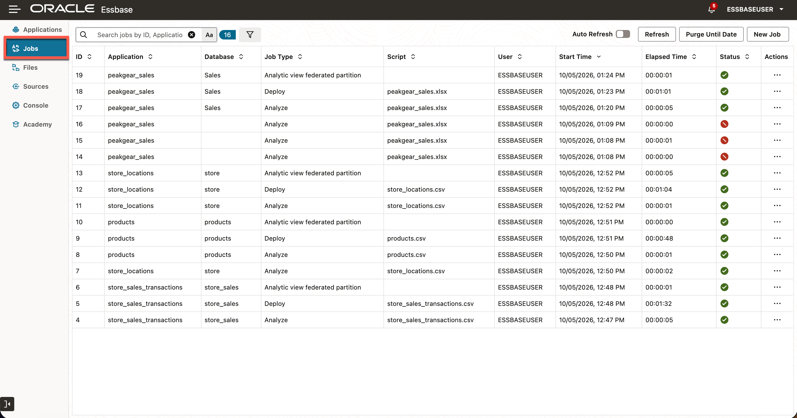

2. Open the job details and confirm that the job completed successfully.
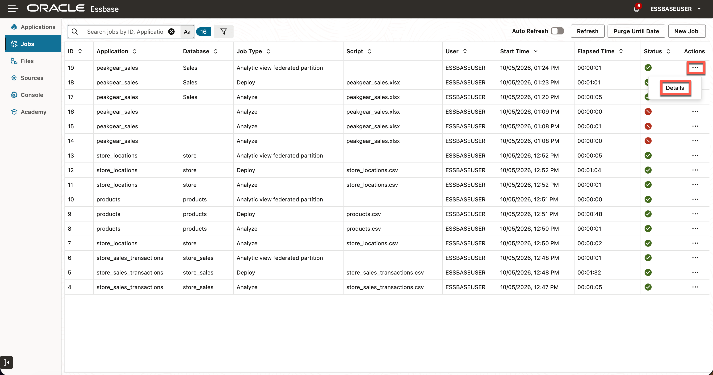

3. If the job reports an error, review its details before continuing.
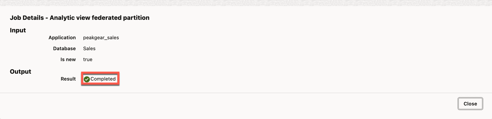

## Task 3: Inspect the Cube Outline

1. On the Essbase Applications page, open `peakgear_sales`.
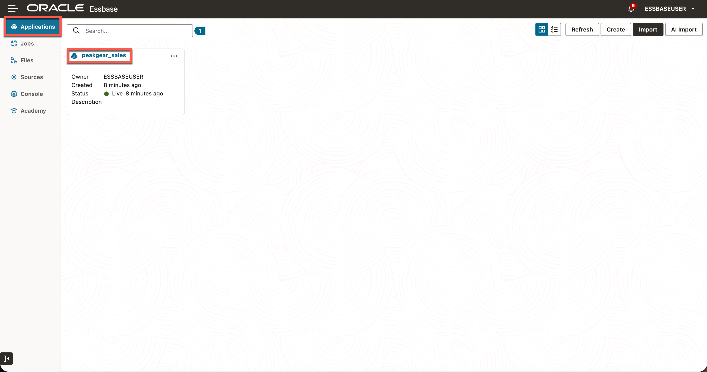

2. Under **Database** click the three dots next to **Sales** then **Outline**.
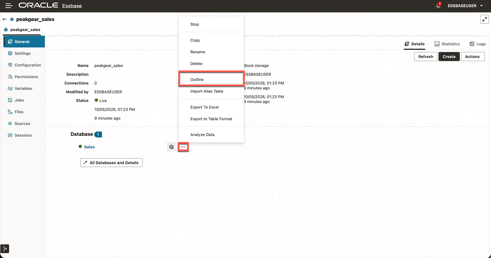

3. Expand the `Time`, `Store`, `Product`, and `Measures` dimensions. Confirm that the outline includes years, quarters, months, cities, stores, product categories, SKUs, and the `Units` and `Sales` measures.
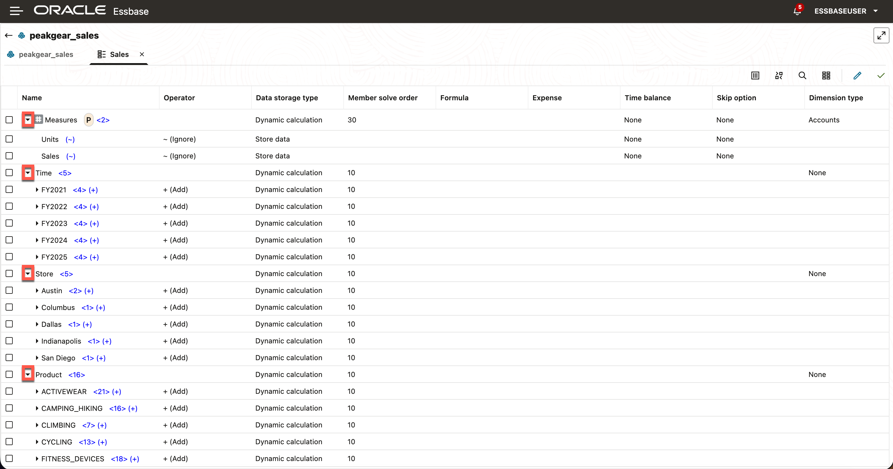

## Task 4: Verify a Known Sales Value

1. Go back to the Home Page and open the `peakgear_sales` application again.

2. Under **Database** click the Cube button next to **Sales** to **Analyze Data**.
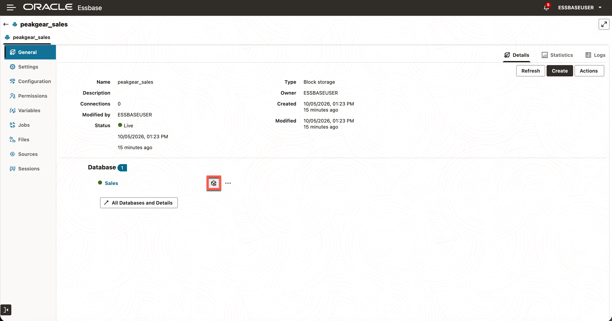

3. In **Ad Hoc Analysis**, select a member and click **Zoom In** in the upper-left toolbar. Repeat along each path:

   - `Time` → `FY2021` → `2021-Q1` → `2021-01`
   - `Product` → `ACTIVEWEAR` → `SKU-100002`
   - `Store` → `Austin` → `Store_004`
   - `Measures` → `Sales`

4. Select each final member and click **Keep Only**. Confirm the resulting sales value is **1,448.55**.
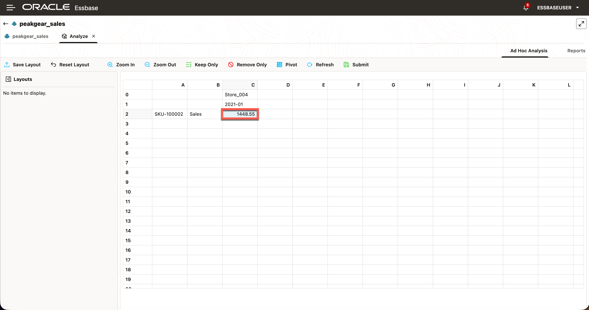

You have imported the prepared PeakGear sales cube and verified its outline and data.

## Learn More

- [Create and Update a Cube from Tabular Data](https://docs.oracle.com/en/database/other-databases/essbase/21/esscd/create-and-update-cube-tabular-data.html)
- [Analyze Data in the Web Interface](https://docs.oracle.com/en/database/other-databases/essbase/26/ugess/analyze-data-web-interface.html)

## Acknowledgements

* **Author** - Ty Wolber, Cloud Engineer
* **Last Updated By/Date** - Ty Wolber, October 2026