# Launch Embedded Essbase

## Introduction

In this lab, you will open embedded Essbase from Database Actions and sign-in with the Essbase user created in Lab 1. You will confirm that the Essbase home page is available before importing the PeakGear Sporting Goods application in the next lab.

Estimated Lab Time: 10 minutes

### About Essbase

Essbase provides multidimensional cubes for analyzing business data. In this workshop, Essbase is available from the Data Studio area of Database Actions in your existing Autonomous AI Lakehouse.

### Objectives

In this lab, you will:

- Launch Essbase from Data Studio.
- Sign in to Essbase and verify that it provisioned properly.
- Confirm the Import action is available for the Essbase user.

### Prerequisites

This lab assumes you have:

- Access to the existing Autonomous AI Lakehouse with embedded Essbase enabled.
- The workshop user's Database Actions URL, username, and password from Lab 1.

## Task 1: Launch Essbase from AI Lakehouse

1. Return to your AI Lakehouse details page.

2. Click on **Tool Configuration** from the ribbon options.
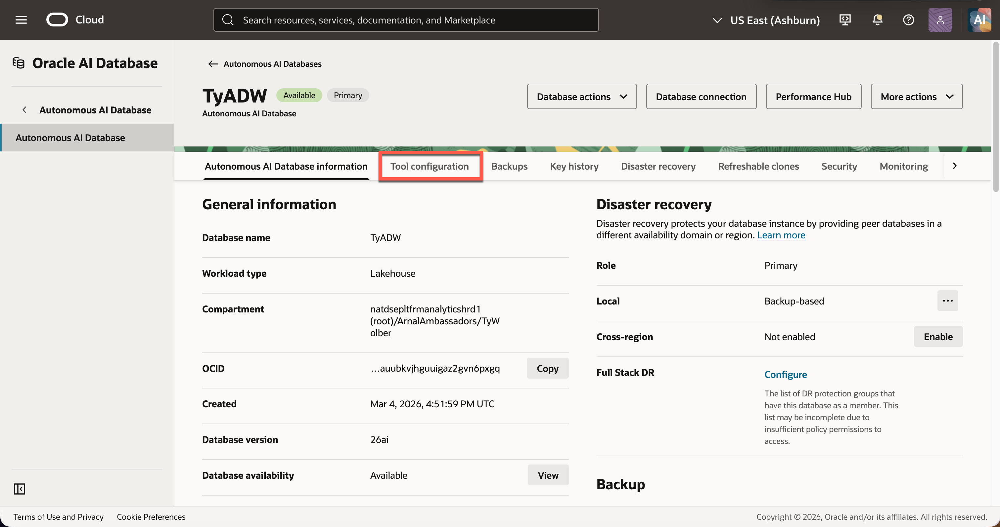

3. Scroll down to **Essbase** then click **Edit**.
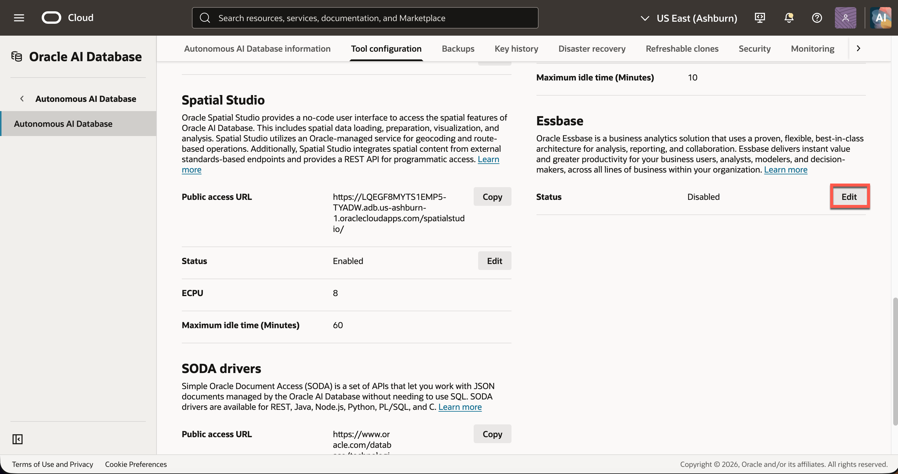

4. Toggle **Enable Essbase** on and click apply. You can configure the OCPU count and idle time here as well.
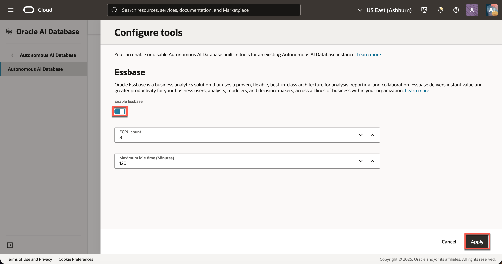

5. After AI Lakehouse finishes updating, copy the URL under Essbase and paste it in a new browser window.

    > **Note:** Alternatively, launch Essbase by copying the Database actions URL from the search bar and replace `/ords/...` with `/essbase/jet`
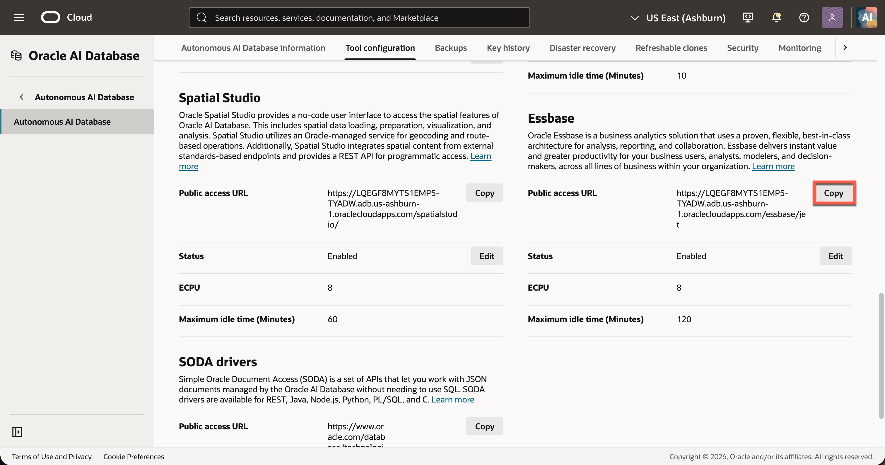

6. On the Essbase sign-in page, enter the **Admin Credentials**.
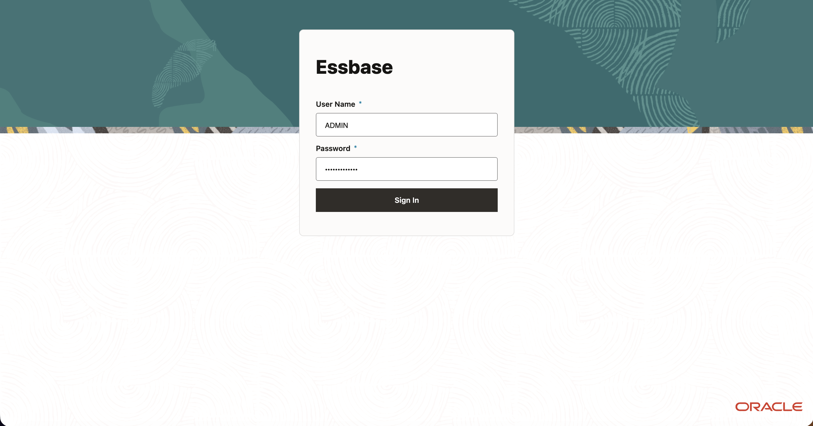

7. Select **Sign In**. Essbase will take a few minutes to provision when the first user logs in. After provisioning starts proceed to Task 2.

## Task 2: Catalog Object Storage Configuration

1. While Essbase provisions, go back to your OCI console tab. Click the **Navigation Menu** in the top left then **Storage → Buckets**.
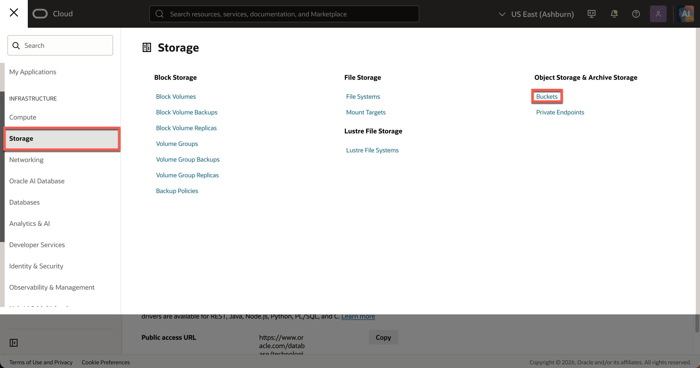

2. Select the compartment designated for the lab, then click **Create bucket**.
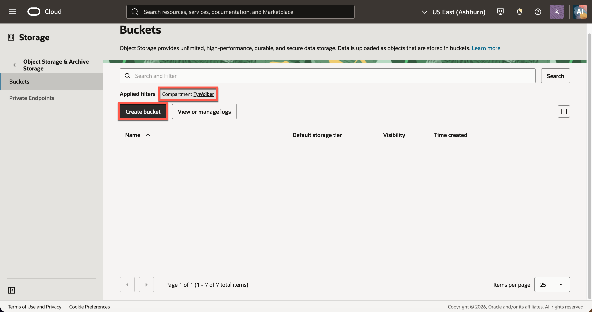

3. Enter a unique name, such as `essbase-embedded-ailakehouse-catalog`. Select the **Standard** storage tier and leave the rest as default, then click **Create Bucket**.
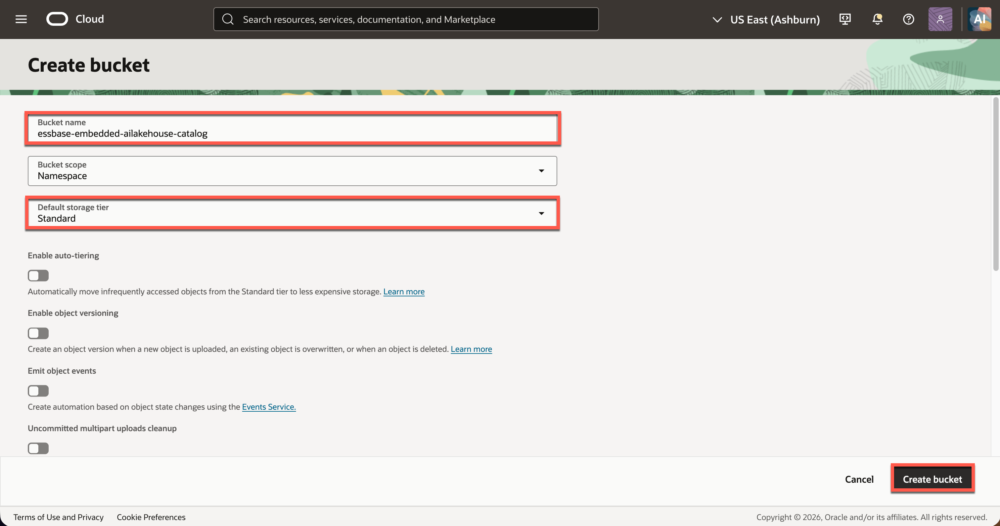

4. Open the new bucket. Record its **Bucket name** and **Namespace** from the bucket details. Essbase needs the bucket name, not the bucket OCID.
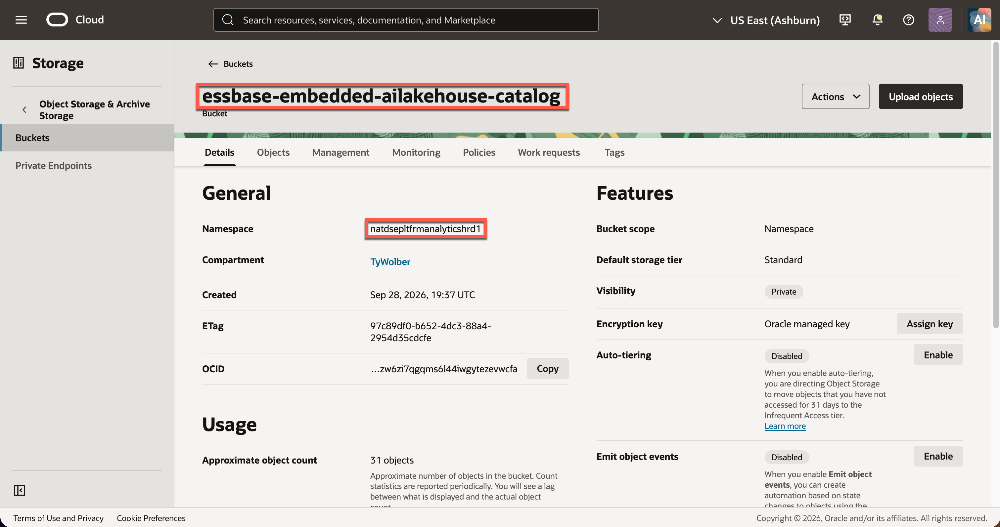

5. Open your profile menu and select **User settings**. Copy the **User OCID**. This must be the OCI user who created the bucket.
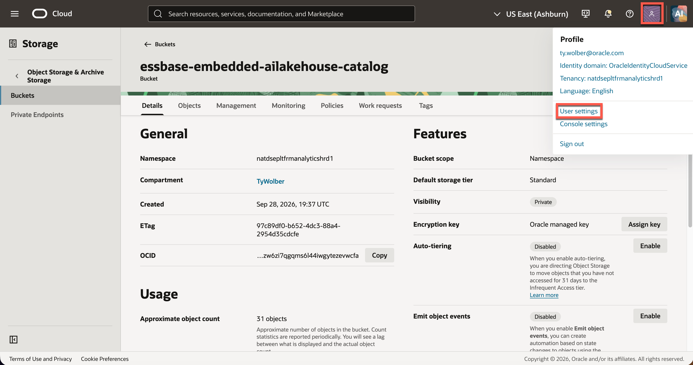
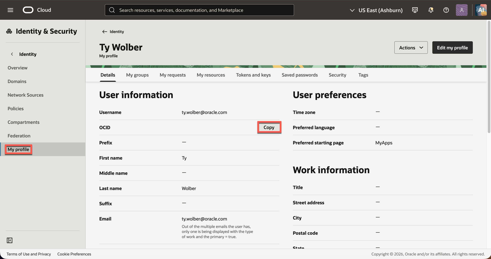

6. On the same user page, open **Tokens and keys**. If you already have the matching private key file, copy its **Fingerprint** and skip step 7. Otherwise, click **Add API Key**.
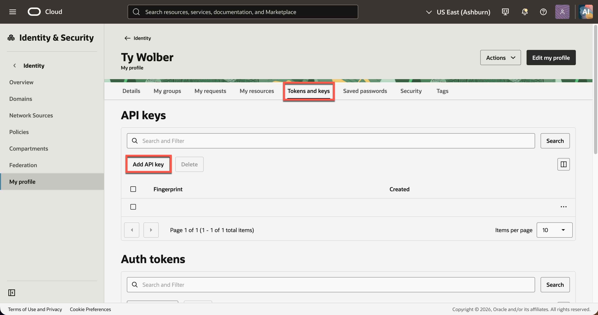

7. Download the new **private key** `.pem` file then click click **Add**
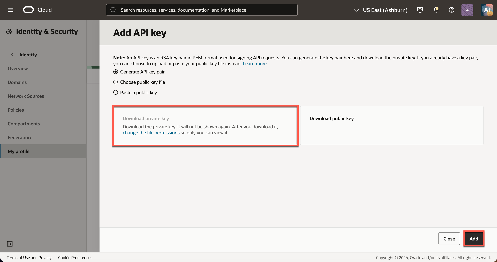

8. Copy the displayed fingerprint under **Fingerprint**. Keep the private key in a secure location.
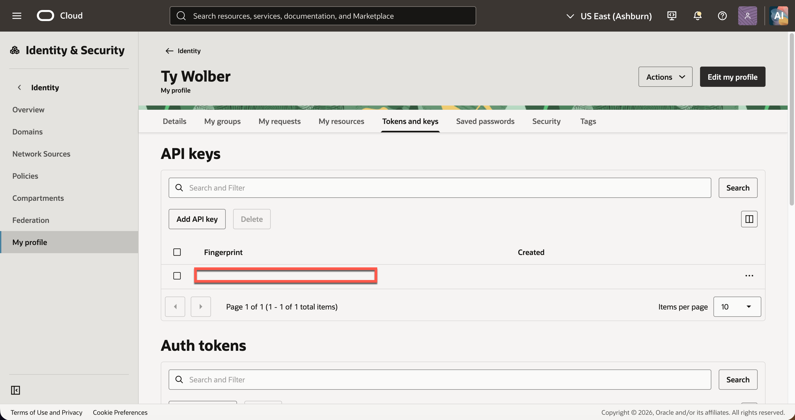

9. Open the profile menu and select **Tenancy: <tenancy name>**. Copy the **Tenancy OCID**.
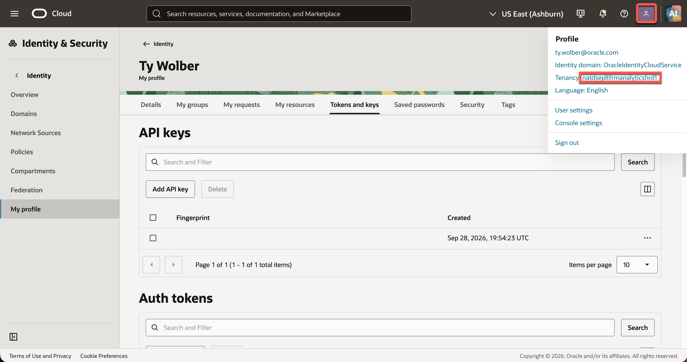
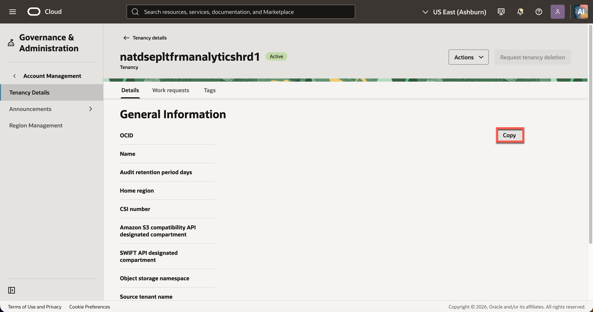

4. Return to the **Catalog Object Storage** form in Essbase and enter:

   | Essbase field | Value to enter |
   | --- | --- |
   | **User ID** | The OCI **User OCID** from User settings |
   | **Fingerprint** | The fingerprint of the API key paired with your private `.pem` file |
   | **Tenancy** | The **Tenancy OCID** |
   | **Region** | The bucket's OCI region identifier, for example `us-ashburn-1` |
   | **Key file** | Select the downloaded **private API signing key** `.pem` file |
   | **Key file content** | Confirm the private key content appears after selecting the file; if needed, paste the private PEM content directly into this Essbase field |
   | **Namespace** | The Object Storage namespace shown in the bucket details |
   | **Bucketname** | The exact bucket name created above |
   | **Private key passphrase** | Enter it only if the private key was created with a passphrase |

5. Save the catalog configuration and confirm Essbase opens successfully. Then continue to the application import.

> **Note:** The private key is different from an SSH key or a public API key. Do not put its contents or passphrase in the LiveLab Markdown, screenshots, or a Git repository. If initialization fails, verify that the fingerprint matches the selected private key and that its OCI user can access the bucket.

3. Confirm that the Essbase home page opens and that you are signed in as the workshop user.
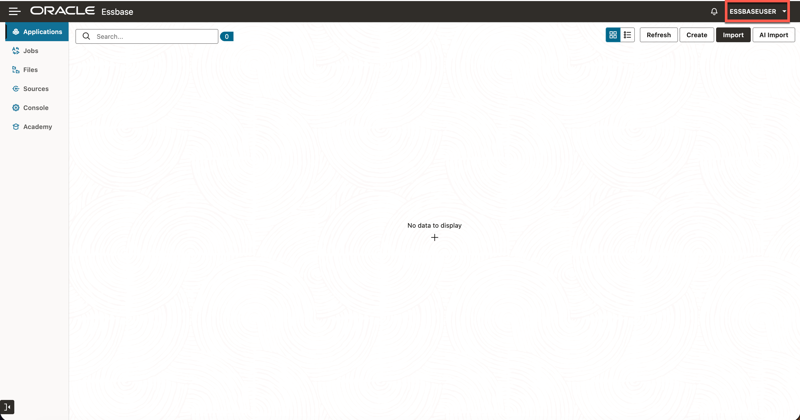

4. Locate the **Applications** area and the **Import** action. You will import and verify the prepared PeakGear application in the next lab.

    > **Note:** If the Essbase user cannot sign-in to Essbase, return to Data Actions as the ADMIN user and refer to Lab 1 Task 3.

You have launched embedded Essbase and verified the workshop user's sign-in.

## Learn More

- [Connect with Built-In Oracle Database Actions](https://docs.oracle.com/en/cloud/paas/autonomous-database/serverless/adbsb/connect-database-actions.html)
- [Using the Oracle Essbase Web Interface](https://docs.oracle.com/en/database/other-databases/essbase/26/ugess/index.html)

## Acknowledgements

* **Author** - Ty Wolber, Cloud Engineer
* **Last Updated By/Date** - Ty Wolber, October 2026