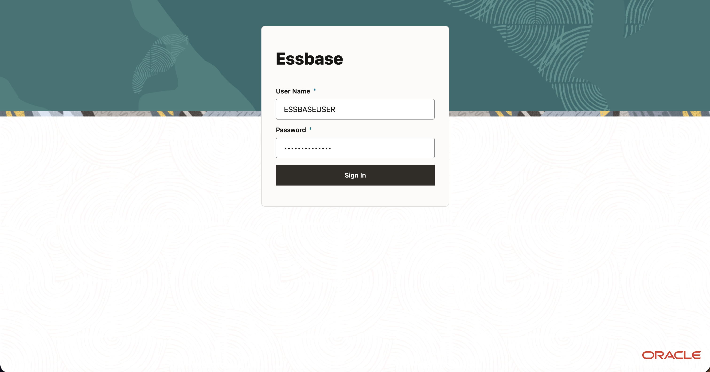

# Launch Embedded Essbase

## Introduction

In this lab, you will open embedded Oracle Essbase from Database Actions and sign in with the workshop user created in Lab 1. You will confirm that the Essbase home page is available before importing the PeakGear application in the next lab.

Estimated Lab Time: 10 minutes

### About Embedded Essbase

Essbase provides multidimensional cubes for analyzing business data. In this workshop, Essbase is available from the Data Studio area of Database Actions in your existing Autonomous AI Lakehouse.

### Objectives

In this lab, you will:

- Launch Essbase from Data Studio.
- Sign in to Essbase and verify that its home page opens.
- Confirm that the Import action is available for the PeakGear application workbook.

### Prerequisites

This lab assumes you have:

- Access to the existing Autonomous AI Lakehouse with embedded Essbase enabled.
- The workshop user's Database Actions URL, username, and password from Lab 1.
- Network access to Database Actions and Essbase.

## Task 1: Launch Essbase from Data Studio

1. On the Database Actions launchpad, select **Data Studio**.

2. Select **Essbase**. Essbase will open in your browser.

    > **Note:** Alternatively, launch Essbase by copying the Database actions URL from the search bar and replace `/ords...` with `/essbase/jet`

## Task 2: Verify the Essbase Home Page and Signed-In User

1. On the Essbase sign-in page, enter the username and password for the workshop user created in Lab 1.

2. Select **Sign In**. Essbase will take a few minutes to provision after the first user logs in.

3. Confirm that the Essbase home page opens and that you are signed in as the workshop user.

4. Locate the **Applications** area and the **Import** action. You will import and verify the prepared PeakGear application in the next lab.

    > **Note:** If the workshop user cannot sign in to Essbase, confirm that the database account is open and ask your administrator to check the user's Essbase access.

You have launched embedded Essbase and verified the workshop user's sign-in.

## Learn More

- [Connect with Built-In Oracle Database Actions](https://docs.oracle.com/en/cloud/paas/autonomous-database/serverless/adbsb/connect-database-actions.html)
- [Using the Oracle Essbase Web Interface](https://docs.oracle.com/en/database/other-databases/essbase/26/ugess/index.html)

## Acknowledgements

* **Author** - Ty Wolber, Cloud Engineer
* **Last Updated By/Date** - Ty Wolber, October 2026